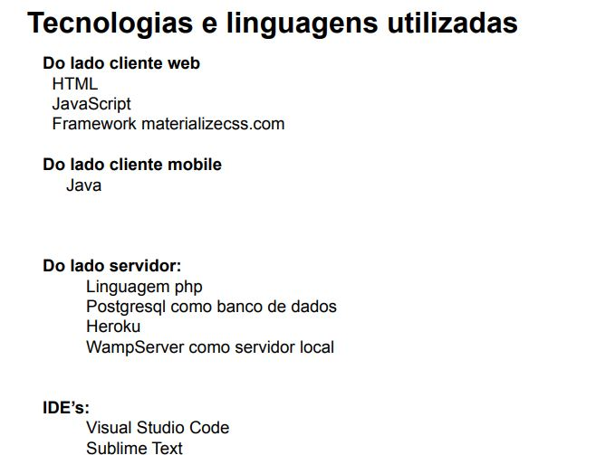

<h1> Minimundo </h1>
  Simulações geopolíticas são uma forma de levar para o mundo estudantil
o universo da geopolítica. Compreender como funcionam essas reuniões é
muito útil para o entendimento de relações internacionais. Dito isso, uma
plataforma que auxiliasse a realização dessas simulações de forma remota
e, possivelmente, também presencial, seria uma forma de atrair
estudantes para participar das simulações presenciais. Além disso, essa
plataforma permitiria a realização dos eventos de forma online quando
algo impossibilita que sejam realizados presencialmente(pandemia, falta
de verba, etc). Nele devemos permitir ao usuário que cadastre um perfil e
que, através dele, participe ou crie comitês de simulação. O simulador
possuirá plataforma web e mobile, ambas com interfaces intuitivas e
compreensivas
  
<h1> Protótipo do Sistema </h1>
  
  
<h1> Revisão de Usabilidade </h1>
  
<h1> Backlog </h1>

  

<h1> Modelo de Classe</h1>
  

 <h1> Lições Aprendidas</h1>
  

 <h1> Projeto do Sistema </h1>
   
